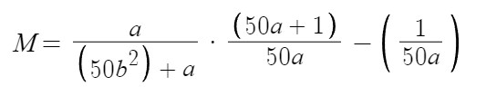

# ReBeat
ReBeat is a Beat Saber overhaul mod created by Inscolosus and Astrella to put the game in a more competitively viable and fun state! It features a new scoring system, reworked game mechanics including a new health system, modifiers, and more.
- [Join our Discord](https://discord.gg/gqTQcS3fGj)
## How To Use
- Download the zip for your version from the [releases](https://github.com/Inscolosus/ReBeat/releases) and extract it to your Beat Saber folder
- When you select a song there will be a ReBeat icon next to the characteristics, click it to enable ReBeat

- With ReBeat enabled the modifiers panel will disappear, to use modifiers select the Modifiers menu under the Mods section

- Leaderboards for ReBeat are supported by [BeatLeader](https://beatleader.net); you will need the [BeatLeader Mod](https://github.com/BeatLeader/beatleader-mod) if you want to submit scores
- ReBeat will automatically use a new [HitScoreVisualizer](https://github.com/ErisApps/HitScoreVisualizer) config, by default it looks for one named `HitScoreVisualizerConfig_100max.json` (included in release zip). This can be changed in the mod's userdata (`UserData/ReBeat.json`)
- ReBeat currently only supports custom songs, although this may change in the future

## Dependencies
- BSIPA, SongCore, and BSML

You likely already have these, if not they can be installed with [ModAssistant](https://github.com/Assistant/ModAssistant/releases/latest) or downloaded from [BeatMods](https://beatmods.com/#/mods)
## Changes
### Scoring
The maximum cut score is now 100, consisting of:
- 30 points (pre swing)
- 20 points (post swing)
- 50 points (accuracy)

The angle required for full pre- and post-swing points has been reduced to 95° and 55°, respectively.

Accuracy has also been changed—instead of an even spread of points from the center, there are now larger sectors that give set point values:

#### The size of these sectors is changed by some modifiers

| Easy Mode | Normal  | Pro Mode | Points  |
|:---------:|:-------:|:--------:|:-------:|
| 8 - 15    | 9 - 15  | 11 - 15  | 50      |
| 5, 6, 7   | 6, 7, 8 | 7 - 10   | 44      |
| 3, 4      | 4, 5    | 4, 5, 6  | 36      |
| 2         | 2, 3    | 2, 3     | 22      |
| 1         | 1       | 1        | 10      |

Scoring has been completely changed to a [new algorithm](#score-algorithm) based off of average note score (described above), misses, and combo

Scores are displayed as this point value, with the average note score as accuracy.
### Energy
Energy has been changed to a shield and health battery system, similar to the existing Battery Energy modifier. 
The energy bar now consists of nine segments, the first five of which are green (health), with the remaining four being blue (shield). 
Upon missing a note (or wall put description here later) a segment will be lost. 
Shield can be recovered back to a maximum of four segments by holding a combo. Heath is lost permanently.

The number of notes required to regenerate a segment of shield is determined by this curve, where x is the map's nps:

### Other
- Cut angle tolerance has been reduced to 90° (originally 120°)
- Note hitbox is much smaller (0.5m x 0.5m x 0.7m instead of 0.8m x 0.5m x 1m)
- Removed wrong color bad cuts
### Brand New Modifiers
- One HP
  - Reduces health from five segments to one
- Pro Mode
  - Increases NJS
  - Decreases cut angle tolerance to 75°
  - Decreases note hitbox size (0.45m x 0.45m x 0.6m)
  - Harsher accuracy [(see table)](#the-size-of-these-sectors-is-changed-by-some-modifiers)
- Easy Mode
  - Increases cut angle tolerance to 105°
  - Increases note hitbox size (0.8m x 0.5m x 0.8m)
  - Lenient accuracy [(see table)](#the-size-of-these-sectors-is-changed-by-some-modifiers)
- Hidden
  - Notes spawn in as full blocks and fade away
- Same Color
  - All notes appear the same color
### Altered Modifiers
- Faster Song now increases NJS by 10% (was 20%)
- Super Fast Song now increases NJS by 30% (was 50%)
### Legacy Modifiers
These modifiers don't fit in to ReBeat and so will not positively affect your score, but you may still use them if you wish:
- No Arrows
- No Bombs
- No Walls
- Ghost Notes
- Disappearing Arrows
- Small Notes
### Removed
- Strict Angles
- Zen Mode
## Score Algorithm
Score is calculated from three curves (below) as 1000000 * (0.3M + 0.3C + 0.4A)

Misses - where a = map note count, and b = misses: 

Combo - where a = map note count, and c = max combo:

Accuracy - where d = accuracy (avg note score): 

